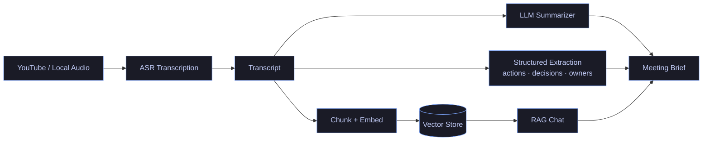
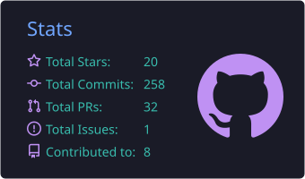
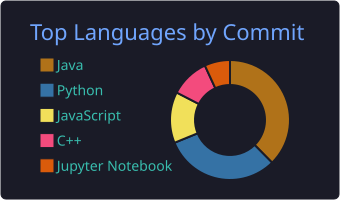
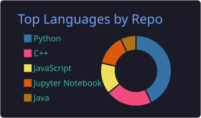
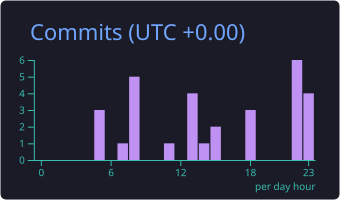

<div align="center">


<a href="https://github.com/shivamchauhan29">

</a>

<br/>

<a href="https://www.linkedin.com/in/shivamchauhan29/"></a>
<a href="https://medium.com/@shivamchauhan29"></a>
<a href="https://twitter.com/shivamchauhan29"></a>
<a href="https://hyginox.in"></a>


</div>

---

## `~/whoami`

```python
class Shivam:
    role       = ["AI Engineer", "Product Manager"]
    education  = "M.Tech Data Science @ Delhi Technological University (2025–27)"
    experience = ["VoyageX AI — AI features in maritime ERP", "Zerobug — enterprise software"]
    founder_of = "Hyginox — Active Oxygen home-hygiene brand (hyginox.in)"
    building   = ["LLM + RAG apps", "multimodal ML", "SEO-driven Next.js platforms"]
    stack      = ["Python", "PyTorch", "FastAPI", "Next.js", "Firebase", "GCP"]
    open_to    = "AI Engineer / AI PM roles · collaborations · open source"

    def ship(self):
        return "idea → prototype → production → measure"
```

---

## 🧠 Featured Build — AI Video Assistant

> End-to-end meeting intelligence: any YouTube link or local audio → transcript, summary, structured extraction, and chat.



---

## 🚀 Projects

<table>
<tr>
<td width="50%" valign="top">
<h3><a href="https://github.com/shivamchauhan29/AI-Video-Assistant">🎥 Video Intelligence & Content Repurposing Platform</a></h3>
<p>YouTube/local audio → transcript → summary → extraction → RAG chat.</p>


</td>
<td width="50%" valign="top">
<h3><a href="https://github.com/shivamchauhan29/ad-creative-intelligence">📈 Ad Creative Intelligence</a></h3>
<p>Multimodal ML model that predicts ad-creative performance.</p>


</td>
</tr>


</table>

| | Project | Impact |
|:-:|---|---|
| 🎥 | **AI Video Assistant** | Transcript → summary → extraction → RAG chat in one pipeline |
| 📈 | **Ad Creative Intelligence** | Multimodal model that predicts ad-creative performance |
| 📚 | **ML Atlas** | Large-scale interactive ML learning platform |
| 🧴 | **Hyginox Platform** | Next.js storefront + editorial CMS with built-in SEO scoring |
| 📄 | **Document Boundary Segmentation** | U-Net for document boundary detection |

---

## ⚡ Tech Arsenal

<div align="center">


<br/>


</div>

---

## 📊 Live Telemetry

<div align="center">








</div>

---

## ✍️ Latest Writing

<table>
<tr>
<!-- BLOG-POST-LIST:START --><td width="33%" valign="top"><h3>🔥</h3><a href="https://medium.com/@shivamchauhan29/firebase-9-0-a-new-era-of-app-development-65214f2834b8?source=rss-6661d103da27------2"><b>Firebase 9.0: A New Era of App Development</b></a><br/><br/><sub>📅 Jun 8, 2023</sub></td><td width="33%" valign="top"><h3>🚀</h3><a href="https://medium.com/@shivamchauhan29/gatsby-the-next-generation-of-static-site-generators-f264bca5a5bc?source=rss-6661d103da27------2"><b>Gatsby: The Next Generation of Static Site Generators</b></a><br/><br/><sub>📅 May 18, 2023</sub></td><td width="33%" valign="top"><h3>📝</h3><a href="https://medium.com/@shivamchauhan29/mastering-wordpress-development-essential-tips-and-tricks-d8107a44d280?source=rss-6661d103da27------2"><b>Mastering WordPress Development: Essential Tips and Tricks</b></a><br/><br/><sub>📅 May 17, 2023</sub></td><!-- BLOG-POST-LIST:END -->
</tr>
</table>

<div align="center">

<a href="https://medium.com/@shivamchauhan29"></a>

</div>

<br/>

<div align="center">


</div>
